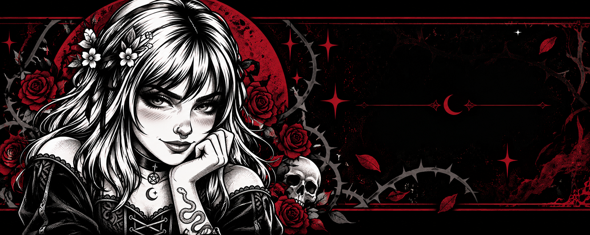

# 🌸 Cristi AI Companion — Asistente IA Multimodal con Live2D & Gemini Multimodal Live API

<div align="center">




**Plataforma de compañera de escritorio y asistente agéntica virtual de alto rendimiento construida con Electron 32 + React 19 + Vite 8. Impulsada por Google Gemini Multimodal Live API (`gemini-3.1-flash-live-preview` y `gemini-2.5-flash-native-audio-preview`), motor universal de avatares Live2D Cubism con 13 personajes oficiales, físicas cinéticas invariantes, seguimiento del cursor por todo el escritorio (*Desktop-Wide Tracking*), biometría vocal, visión sensorial a 60 FPS, compañeros autónomos en Minecraft y Discord, reproducción en Spotify, captura de audio WASAPI de bajo nivel y observabilidad en tiempo real.**

[](https://github.com/WriteColor)
[](LICENSE)
[](https://nodejs.org/)
[](https://pnpm.io/)
[](https://react.dev/)
[](https://www.electronjs.org/)
[](https://aistudio.google.com/)

</div>

---

## 📑 Tabla de Contenidos
1. [Instalación Rápida en 1 Clic (`setup.bat` / `setup.ps1`)](#-instalación-rápida-en-1-clic-setupbat--setupps1)
2. [Arquitectura y Modelos de Inteligencia Artificial](#-arquitectura-y-modelos-de-inteligencia-artificial)
3. [Los 6 Pilares de la Arquitectura](#-los-6-pilares-de-la-arquitectura)
4. [Catálogo Oficial de las 16 Voces Neuronales de Gemini](#-catálogo-oficial-de-las-16-voces-neuronales-de-gemini)
5. [Catálogo Oficial de los 13 Modelos Live2D Cubism](#-catálogo-oficial-de-los-13-modelos-live2d-cubism)
6. [Catálogo de Herramientas Agénticas y Capacidades](#-catálogo-de-herramientas-agénticas-y-capacidades)
7. [Integraciones Multimedia: Minecraft, Discord, Spotify y Juegos](#-integraciones-multimedia-minecraft-discord-spotify-y-juegos)
8. [Sistema de Actualización Local y Offline](#-sistema-de-actualización-local-y-offline-zero-network)
9. [Tabla de Atajos de Teclado y Controles](#-tabla-de-atajos-de-teclado-y-controles)
10. [Seguridad y Protección de Claves de API](#-seguridad-y-protección-de-claves-de-api)
11. [Guía de Instalación Manual Paso a Paso](#-guía-de-instalación-manual-paso-a-paso)
12. [Estructura del Repositorio](#-estructura-del-repositorio)
13. [Licencia y Contribución](#-licencia-y-contribución)

---

## ⚡ Instalación Rápida en 1 Clic (`setup.bat` / `setup.ps1`)

Para configurar todo el entorno automáticamente sin pasos manuales ni posibilidad de fallo:

* **Windows Explorer:** Haz doble clic en [`setup.bat`](setup.bat).
* **PowerShell:** Ejecuta `.\setup.ps1`.

El instalador automático se encarga de habilitar `pnpm`, instalar dependencias, descargar el motor de Electron, verificar iconos estáticos y validar los 13 modelos de Live2D y 14 redes neuronales. En Windows, el build incluye además el helper WASAPI nativo para capturar la mezcla del dispositivo de salida sin depender de software externo.

---

## 🧠 Arquitectura y Modelos de Inteligencia Artificial

Cristi AI Companion se comunica directamente mediante **WebSocket bidireccional S2S (`BidiGenerateContent`)** con la API en tiempo real de Google Gemini:

| Modelo | ID de API | Especialidad y Capacidades | Latencia / Audio |
|---|---|---|---|
| ⭐ **Gemini 3.1 Flash Live (Predeterminado)** | `gemini-3.1-flash-live-preview` | Diálogo conversacional de ultra-baja latencia voz a voz, comprensión espacial, visión continua, control total de PC y ejecución de herramientas. | ~300ms / 24 kHz |
| 🎙️ **Gemini 2.5 Flash Native Audio** | `gemini-2.5-flash-native-audio-preview-12-2025` | Síntesis afectiva nativa, diálogo continuo y alta compatibilidad con herramientas de control del sistema. | ~400ms / 24 kHz |

---

## 🏛️ Los 6 Pilares de la Arquitectura

1. **Pilar 1: Catálogo de Herramientas Agénticas y Contratos de Eventos:**
   Toda interacción se desacopla mediante un `EventBus` con sobres tipados (`DomainEventEnvelope`), trazabilidad con `correlationId` y soporte para servidores MCP dinámicos (`stdio` y `sse`) en el proceso principal.
2. **Pilar 2: Memoria Persistente Multicapa:**
   Almacenamiento híbrido en **SQLite** nativo con fallback transaccional a JSON atómico, respaldado por un índice semántico local con vectores hash para recuperar recuerdos sin latencia de red.
3. **Pilar 3: Compañero Autónomo de Discord:**
   Bot integrado con `discord.js` v14 y `@discordjs/voice` para canales de texto y voz con decodificación Opus a PCM 16 kHz y reconexión automática resiliente.
4. **Pilar 4: Percepción y Telemetría en Minecraft:**
   Agente autónomo basado en Mineflayer y pathfinding inteligente. Realiza seguimiento de jugadores, minería, construcción y combate contra entidades hostiles con telemetría en tiempo real.
5. **Pilar 5: Árbitro Proactivo y Breathing Room:**
   `InteractionOrchestrator` central con ventana de enfriamiento de 15 segundos para evitar saturar al usuario, algoritmo anti-encadenamiento y bypass inmediato para alertas de emergencia.
6. **Pilar 6: Blindaje de Audio, DSP y Loopback WASAPI:**
   `AudioRoutingService` con aislamiento de retorno (`markGenerated`) para eliminar el eco, captura a 16 kHz por AudioWorklet, streaming de salida a 24 kHz con Lip-Sync espectral, y helper nativo C# (`CristiWasapiLoopback.exe`) para capturar el audio de Windows y juegos sin tarjetas de sonido virtuales.

---

## 🗣️ Catálogo Oficial de las 16 Voces Neuronales de Gemini

Generadas nativamente a **24,000 Hz** con modulación emocional y Lip-Sync orgánico en tiempo real:

### 🔹 Voces Oficiales
| Voz | Rasgo Principal | Descripción Sonora |
|---|---|---|
| 👑 **Aoede (Oficial)** | Dulce, Coqueta & Envolvente | Tono ligero, seductor y muy natural. Voz por defecto de Cristi. |
| **Kore** | Firme, Clara & Equilibrada | Timbre profesional, articulado y confiable. |
| **Leda** | Cálida, Amable & Protectora | Tono maternal y sumamente empático. |
| **Lyra** | Suave, Melódica & Poética | Modulación etérea, ideal para narración y conversación íntima. |
| **Zephyr** | Serena, Aireada & Cristalina | Tono fresco y ligero como una brisa suave. |
| **Ursa** | Resonante, Fuerte & Segura | Presencia vocal con cuerpo acústico y firmeza. |
| **Vega** | Radiante, Alegre & Luminosa | Tono chispeante lleno de optimismo y carisma. |
| **Callisto** | Profunda, Misteriosa & Serena | Matices aterciopelados con cadencia reflexiva. |
| **Ara** | Elegante, Sutil & Sofisticada | Tonalidades suaves con cortesía refinada. |
| **Vela** | Dinámica, Aventurera & Ágil | Ritmo activo y propositivo en cada frase. |
| **Carina** | Luminosa, Expresiva & Emotiva | Alta respuesta afectiva con micro-entonaciones precisas. |
| **Musca** | Vivaz, Curiosa & Espontánea | Tono juguetón y rápido para interacciones divertidas. |
| **Fornax** | Apasionada, Intensa & Creativa | Calidez ardiente con timbre envolvente. |
| **Hydra** | Multifacética & Versátil | Adaptación armónica con rango vocal completo. |
| **Pyxis** | Orientadora, Certera & Precisa | Voz de asistencia con dicción inmaculada. |
| **Gemini Natural** | Equilibrada & Pura | Síntesis neuronal pura optimizada por Google DeepMind. |

*(También disponibles voces masculinas y dinámicas como Puck, Charon, Fenrir, Orion, Pegasus, Perseus, Castor, Pollux, Chiron, Eridanus, Lynx, Indus, Sculptor y Phoenix).*

---

## 🎭 Catálogo Oficial de los 13 Modelos Live2D Cubism

Todos los avatares se cargan mediante WebGL 2.0 y PixiJS v7, desacoplados del ciclo de vida reactivo para un consumo mínimo de memoria:

| Avatar | ID Interno | Origen / Estilo | Características Técnicas |
|---|---|---|---|
| 🖤 **Cristi Gótica (Yandere)** | `yanderegirl` | Original Cristi AI | 75 parámetros cinéticos, físicas de cabello, expresiones `yandere`, `mad`, `crazy`, `blush`. |
| 👘 **Ice Girl (Cheongsam)** | `icegirl` | Traje Oriental Tradicional | 94 parámetros, orejas de gato, alas animadas, ojos de corazón y corona. |
| 🌸 **Hiyori Momose** | `hiyori` | Oficial Live2D Cubism Pro | 64 parámetros, 8 grupos de movimiento, físicas avanzadas de tela y cabello. |
| 🎀 **Miara** | `miara` | Oficial Live2D Cubism Pro | 65 parámetros, gestos de saludo, poses dinámicas y seguimiento ocular. |
| 🛡️ **Toki** | `toki` | Blue Archive | 74 parámetros, modo combate, compostura militar y seguimiento de mirada completo. |
| 🦈 **Ellen Joe** | `ellen` | Zenless Zone Zero | 207 parámetros, maid tiburón con cola animada, tijeras y físicas elásticas. |
| 🐀 **Jane Doe** | `jane_doe` | Zenless Zone Zero | 236 parámetros, agente encubierta con cinemática corporal refinada. |
| 🍵 **Ruan Mei** | `ruan_mei` | Honkai: Star Rail | 114 parámetros, erudita con instrumento tradicional y túnica con físicas de viento. |
| 🎮 **Belle** | `belle` | Zenless Zone Zero | 175 parámetros, protagonista con expresiones dinámicas y gafas. |
| 🎭 **Sparkle** | `sparkle` | Honkai: Star Rail | 174 parámetros, poses de manos, piernas y accesorios tradicionales. |
| 🦊 **Huohuo** | `huohuo` | Honkai: Star Rail | 157 parámetros, 7 animaciones motion3, expresiones de timidez y llanto. |
| ☂️ **Vivian** | `vivian` | Zenless Zone Zero | 197 parámetros, paraguas cerrado, sonrojo y animaciones corporales. |
| 🖤 **Goth Loli Maid** | `goth_loli` | Gothic Lolita / Maid | 30 parámetros, físicas en coletas, parpadeo orgánico y lazos dinámicos. |

---

## 🛠️ Catálogo de Herramientas Agénticas y Capacidades

Cristi cuenta con más de **45 herramientas** para operar de forma autónoma:

1. **Control del Avatar Live2D:** `trigger_companion_gesture`, `trigger_model_motion`, `move_avatar`, `switch_avatar_model`.
2. **Sistema Operativo & PowerShell:** `execute_system_command`, `read_file`, `write_file`, `list_directory`, `get_clipboard`, `set_clipboard`, `get_running_processes`, `kill_process`, `open_file_or_folder`, `open_system_app_or_link`.
3. **Computer Use:** `computer_action` (clics en coordenadas, tipeo nativo, atajos de teclado y scroll).
4. **Visión Contextual:** `capture_screen_snapshot` (capturas a 60 FPS con Electron native), `set_screen_watch`, `set_screen_region`, `analyze_visual_scene`.
5. **Memoria a Largo Plazo:** `manage_memory`, `remember_fact`, `search_memory`, `delete_memory`.
6. **Búsqueda & Navegación:** `search_internet`, `browse_web_page`, `open_in_brave_browser`.
7. **Widgets & Alarmas:** `set_reminder`, `set_alarm`, `show_tactical_widget`, `dismiss_tactical_widget`.
8. **Audio & Traducción:** `start_desktop_audio_capture`, `stop_desktop_audio_capture`, `desktop_audio_capture_status`, `send_game_voice_translation`, `translate_and_speak_in_game`.

Consulta la documentación técnica completa en [`docs/TOOLS_AND_CAPABILITIES.md`](docs/TOOLS_AND_CAPABILITIES.md).

---

## 🎮 Integraciones Multimedia: Minecraft, Discord, Spotify y Juegos

* **Minecraft Companion (`mineflayer`):**
  Cristi se conecta a tu servidor local o remoto, camina contigo mediante pathfinding (`minecraft_follow_player`), extrae minerales (`minecraft_mine_block`), construye y te defiende de monstruos en combate (`minecraft_attack_entity`).
* **Discord Companion (`discord.js` & `@discordjs/voice`):**
  Monitorea canales de texto, responde menciones y puede unirse a canales de voz para interactuar con tu comunidad y traducir audio en tiempo real.
* **Spotify Integration (Desktop & Web API):**
  Control total de tu música: busca pistas en el catálogo global, reproduce álbumes por URI o nombre, salta canciones, pausa y ajusta volumen por voz. Si no tienes la app de escritorio, opera automáticamente el reproductor web en Brave con Playwright. Más detalles en [`docs/GUIA_INTEGRACION_SPOTIFY.md`](docs/GUIA_INTEGRACION_SPOTIFY.md).
* **Audio de Juegos & Loopback WASAPI:**
  Helper nativo en C# (`native/CristiWasapiLoopback.exe`) que captura el sonido del juego o de Windows sin programas externos de cable virtual. Cristi escucha las voces de tus compañeros de partida y puede traducir tus mensajes al canal de voz del juego (`game_voice`) sin emitir por tus altavoces locales.

---

## 📦 Sistema de Actualización Local y Offline (Zero Network)

Cristi AI Companion **no depende de servidores de actualización externos en internet**:

1. Al compilar una nueva versión con `pnpm app:build`, el instalador generado (`Cristi-AI-Companion-Setup-X.Y.Z.exe`) se guarda en la carpeta local `release/`.
2. La aplicación instalada detecta automáticamente en disco si existe una versión superior en la carpeta del proyecto.
3. Desde la pestaña **Ajustes → Actualizaciones**, basta con presionar **"Reiniciar e Instalar Actualización"** para actualizar la app localmente con privilegios de Administrador.

---

## ⌨️ Tabla de Atajos de Teclado y Controles

| Atajo / Control | Tipo | Acción / Comportamiento |
|---|---|---|
| **`Ctrl + Shift + C`** | Global (Sistema) | **Boss Key / Modo Residente**: Oculta o muestra a Cristi al instante (0% GPU/CPU al ocultarse). |
| **`Ctrl + Shift + H`** | Global (Sistema) | **Ocultar / Mostrar UI (Modo Zen Global)**: Alterna la interfaz visible desde cualquier app. |
| **`Ctrl + Shift + P`** | Global (Sistema) | **Telemetría & Profiler (HUD Global)**: Abre/Cierra el panel de FPS y memoria desde cualquier ventana. |
| **`Ctrl + Shift + A`** | Global (Sistema) | **Fijar Siempre Visible (Always-on-Top)**: Conmuta el anclaje de ventana prioritario. |
| **`Ctrl + Shift + M`** | Global (Sistema) | **Silenciar Micrófono**: Activa o silencia la captura de voz con confirmación sonora. |
| **`Ctrl + Shift + S`** | Global (Sistema) | **Visión Instantánea**: Captura la pantalla activa y la envía a Gemini Live. |
| **`F3`** | Interfaz (App) | **Performance Profiler HUD**: Alterna el panel de telemetría de rendimiento y TPS. |
| **`H` / `h`** | Interfaz (App) | **Modo Zen Local**: Oculta los controles flotantes. |
| **`Escape`** | Interfaz (App) | **Cerrar Modales**: Cierra cualquier menú contextual, modal de ajustes o diálogo. |
| **Clic Izquierdo** | Ratón sobre Avatar | Dispara una **reacción emocional aleatoria** adaptada al personaje activo. |
| **Clic Izq. + Arrastre** | Ratón sobre Avatar | **Mueve a Cristi** por cualquier parte de tu monitor con arrastre nativo. |
| **Rueda del Ratón** | Ratón sobre Avatar | **Escalado dinámico** suave del modelo (`0.25x` a `4.0x`). |
| **Clic Derecho** | Ratón sobre Avatar | Despliega el **Menú Contextual Táctico Obsidian**. |

---

## 🔒 Seguridad y Protección de Claves de API

* **Cero Hardcoding:** El código fuente no contiene claves de API ni credenciales privadas.
* **Almacenamiento Seguro:** La clave `VITE_GEMINI_API_KEY` se carga únicamente desde tu archivo `.env` local (ignorado en `.gitignore`) o mediante el almacenamiento cifrado seguro del sistema (`safeStorage` de Electron).
* **Obtención de Clave Gratuita:** Puedes generar tu API Key gratuita en [Google AI Studio](https://aistudio.google.com/).

---

## 🚀 Guía de Instalación Manual Paso a Paso

### 1. Requisitos Previos
* **Windows 10 / 11 (64-bit)**
* **Node.js**: Versión LTS `v20.x`, `v22.x` o `v24.x` ([Descargar Node.js](https://nodejs.org/))
* **pnpm**: Gestor de paquetes obligatorio. Actívalo con Corepack:
  ```powershell
  corepack enable
  corepack prepare pnpm@latest --activate
  ```

### 2. Clonar e Instalar Dependencias
```powershell
git clone https://github.com/WriteColor/cristi-ai.git "Cristi AI"
cd "Cristi AI"
pnpm install
```

### 3. Inicializar y Validar el Entorno
```powershell
pnpm run setup:env
```

### 4. Configurar la API Key
Crea tu archivo `.env` en la raíz del proyecto:
```env
VITE_GEMINI_API_KEY=tu_clave_de_aistudio_aqui
```

### 5. Iniciar en Modo Desarrollo
```powershell
pnpm run app:dev
```

### 6. Compilar el Instalador de Producción (.exe)
```powershell
pnpm run app:build
```
El instalador NSIS standalone (`Cristi-AI-Companion-Setup-1.0.0.exe`) se generará en la carpeta `release/`.

---

## 🏛️ Estructura del Repositorio

```
Cristi AI/
├── electron/                       # Proceso principal nativo de Electron
│   ├── main.cjs                    # Ventana transparente, atajos globales, IPC, actualizador local
│   └── preload.cjs                 # Puente ContextBridge seguro con el renderizador
├── native/                         # Componentes nativos de Windows
│   ├── CristiWasapiLoopback.cs     # Código fuente en C# del capturador WASAPI
│   └── CristiWasapiLoopback.exe    # Helper Core Audio para captura loopback sin dependencias
├── public/                         # Recursos estáticos servidos en tiempo de ejecución
│   ├── live2dcubismcore.min.js     # Runtime oficial de Live2D Cubism Core
│   ├── models/                     # Pesos binarios y manifiestos de TensorFlow / Face-API
│   └── models/live2d/              # 13 carpetas con modelos oficiales Live2D Cubism
├── resources/                      # Iconos de aplicación (.ico, .png)
├── scripts/                        # Scripts de bootstrapper y hooks de instalación
│   ├── generate-brand-assets.cjs   # Generador de logos e iconos de marca
│   ├── postinstall-setup.cjs       # Hook automático postinstall
│   ├── prebuild-electron.cjs       # Preparación de binarios y cachés NSIS
│   └── setup-clean-env.cjs         # Bootstrapper y verificador del entorno
├── src/                            # Aplicación Frontend en React 19 + Vite 8
│   ├── components/                 # Componentes UI (Live2DCanvas, SettingsModal, ContextMenu, etc.)
│   ├── config/                     # Modelos Gemini, Live2D, voces neuronales y herramientas
│   ├── hooks/                      # Hooks React (useClickThrough, usePerformance, etc.)
│   ├── services/                   # Servicios (Live2DController, GeminiLiveSocket, AudioDSP, Vision)
│   ├── App.jsx                     # Orquestador raíz de la aplicación
│   └── index.css                   # Sistema de diseño futurista Obsidian Cyberpunk
├── docs/                           # Documentación técnica completa
│   ├── ARCHITECTURE.md             # Arquitectura del sistema, los 6 pilares y flujo de datos
│   ├── GUIA_INTEGRACION_SPOTIFY.md # Manual de integración con Spotify (Desktop, Web API y Playwright)
│   ├── INSTALLATION_GUIDE.md       # Guía de instalación y puesta a punto paso a paso
│   ├── LIVE2D_MODELS.md            # Catálogo técnico de los 13 modelos Live2D Cubism
│   ├── SHORTCUTS_AND_CONTROLS.md   # Guía de atajos de teclado, gestos y menú contextual
│   └── TOOLS_AND_CAPABILITIES.md   # Catálogo completo de las 45+ herramientas agénticas
├── electron-builder.config.cjs     # Configuración del instalador NSIS de 64-bit
├── setup.bat / setup.ps1           # Instaladores automáticos en 1 clic
├── CONTRIBUTING.md                  # Guía para contribuidores open-source
├── LICENSE                         # Licencia MIT oficial
└── package.json                    # Manifiesto de paquetes y scripts de pnpm
```

---

## 📄 Licencia y Contribución

Este proyecto es de código abierto y está distribuido bajo la [Licencia MIT](LICENSE).
Para contribuir con mejoras, optimizaciones o nuevos avatares, consulta [CONTRIBUTING.md](CONTRIBUTING.md).

<div align="center">
Creado y mantenido por <b>Write_Color</b>.
</div>
