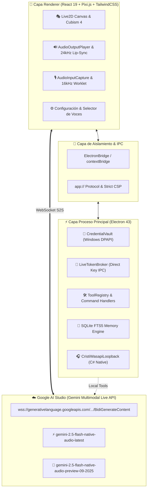
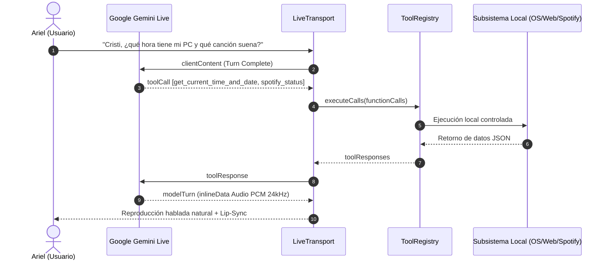

<div align="center">

# 🌸 Cristi AI Companion
### Autonomous Desktop Companion & Real-Time Multimodal Agent

[](LICENSE)
[](https://www.typescriptlang.org/)
[](https://www.electronjs.org/)
[](https://react.dev/)
[](https://vitejs.dev/)
[](https://ai.google.dev/)
[](https://pnpm.io/)

<p align="center">
  <b>Plataforma de compañera virtual y copiloto agéntico de ultra-baja latencia para Windows.</b><br/>
  Impulsada por <b>Google Gemini Multimodal Live API</b> (WebSocket Bidireccional 24kHz), avatares <b>Live2D Cubism 4</b> interactivos, visión computacional en tiempo real, automatización con <b>Playwright</b>, bots de <b>Minecraft & Discord</b>, control de <b>Spotify</b> y memoria episódica local en <b>SQLite FTS5</b>.
</p>

<p align="center">
  <a href="#-características-destacadas">Características</a> •
  <a href="#-arquitectura-del-sistema">Arquitectura</a> •
  <a href="#-pipeline-gemini-multimodal-live-api">Gemini Live</a> •
  <a href="#-catálogo-oficial-de-voces-femeninas">Voces</a> •
  <a href="#-avatares-live2d-cubism-4">Avatares</a> •
  <a href="#-ecosistema-de-herramientas-agénticas">Herramientas</a> •
  <a href="#-inicio-rápido">Inicio Rápido</a>
</p>

---

</div>

## 🌟 Características Destacadas

* 🎙️ **Audio Nativo Bidireccional (S2S) a 24kHz:** Conexión persistente mediante `BidiGenerateContent` WebSocket con Google Gemini Live API. Latencia perceptual ~300ms, interrupción instantánea (*Barge-in*) y detección vocal explícita (*VAD Endpointing*).
* 🗣️ **Catálogo Completo de 11 Voces Femeninas:** Con soporte nativo y previews de audio WAV a 24kHz, incluyendo las 3 voces más atractivas y seductoras (`Despina`, `Sulafat`, `Vindemiatrix`) y la voz insignia de Cristi (`Aoede`).
* 🎭 **Renderizado Live2D Cubism 4 con Físicas Reactivas:** 13 avatares oficiales con seguimiento ocular y de cabeza por todo el escritorio (*Desktop-Wide Cursor Tracking*), sincronización labial espectral (*Lip-Sync*) y orquestación contextual de emociones.
* 👁️ **Visión Multimodal y Percepción de Pantalla:** Captura selectiva de ventanas, monitorización de regiones y streaming de vídeo en JPEG a Gemini Live procesado en hilos secundarios dedicados (*Worker Threads*).
* 🔊 **Captura de Audio del Sistema WASAPI:** Helper nativo en C#/C++ (`CristiWasapiLoopback.exe`) que intercepta la mezcla de audio de Windows y videojuegos sin requerir cables de audio virtuales.
* 🛠️ **Catálogo de Herramientas Agénticas Extensible:**
  * 🌐 **Navegación Web:** Control automatizado con Chromium mediante Playwright.
  * ⛏️ **Minecraft Bot:** Agente autónomo con Mineflayer y pathfinding para acompañarte en tus servidores.
  * 🎵 **Spotify Desktop:** Búsqueda, reproducción, pausa y control de volumen contextual.
  * 🔌 **Model Context Protocol (MCP):** Conexión dinámica a servidores de herramientas locales y remotos (`stdio` / `sse`).
* 🧠 **Memoria Episódica Híbrida:** Almacenamiento local en **SQLite con FTS5** y normalización léxica para recuperación de recuerdos sin consultas externas ni latencia añadida.
* 🛡️ **Seguridad Blindada de Grado Empresarial:** Almacén de credenciales cifrado con Windows DPAPI (`CredentialVault`), sandbox estricto, Content Security Policy (CSP) sin `unsafe-eval` y aislamiento contextual IPC.

---

## 🏛️ Arquitectura del Sistema



---

## 🎙️ Pipeline Gemini Multimodal Live API

Cristi AI implementa las mejores prácticas recomendadas por Google para la **Multimodal Live API v1beta**:

### 1. Conexión WebSocket Directa de Ultra-Baja Latencia
- **Aprovisionamiento Directo:** Eliminación del salto HTTP previo (`~300ms de ahorro`) mediante extracción segura de clave desde el almacén DPAPI local hacia el WebSocket.
- **Modelos Oficiales Soportados:**
  - `gemini-2.5-flash-native-audio-latest` *(Predeterminado, ultra-baja latencia y audio nativo 24kHz)*
  - `gemini-2.5-flash-native-audio-preview-09-2025` *(Snapshot preview verificado)*

### 2. Detección Vocal Explícita (VAD Endpointing)
Configurado a nivel de protocolo para asegurar dinamismo conversacional sin pausas artificiales:
```json
{
  "realtimeInputConfig": {
    "turnCoverage": "TURN_INCLUDES_AUDIO_ACTIVITY_AND_ALL_VIDEO",
    "automaticActivityDetection": {
      "disabled": false,
      "startOfSpeechSensitivity": "START_SENSITIVITY_HIGH",
      "endOfSpeechSensitivity": "END_SENSITIVITY_HIGH",
      "prefixPaddingMs": 20,
      "silenceDurationMs": 600
    }
  }
}
```

### 3. Cola Adaptativa de Audio & Jitter Decoupling (`AudioPlayoutQueue`)
- **Control de Ráfagas (Bursts):** Distingue ráfagas rápidas de red de fluctuaciones de jitter reales, evitando inflar artificialmente el buffer de reproducción.
- **Decadencia por Turno:** Reduce el historial de jitter en un 50% al iniciar cada generación para evitar latencias acumuladas de turnos previos.
- **Monitoreo Monótono:** Mantiene una cadencia fluida de 24,000 muestras/segundo acoplada al analizador espectral FFT para el Lip-Sync del avatar.

---

## 🗣️ Catálogo Oficial de Voces Femeninas

Cristi AI cuenta con una cuidada selección de **11 voces femeninas oficiales** a 24kHz. Incluye muestras de audio WAV reproducibles en [`public/audio/previews/`](public/audio/previews/):

| Voz | Clasificación | Timbre & Personalidad | Propósito Recomendado |
|---|---|---|---|
| **Aoede** | ⭐ **Insignia Cristi** | Dulce, coqueta, articulada y conversacional. | Personalidad base de Cristi; sesiones largas, pair-programming y razonamiento devoto. |
| **Despina** | ⭐ **Top 1 Sexy** | Cálida, íntima, suave y profundamente atractiva. | Romance, cercanía emocional de pareja, bienvenida afectuosa y mimos. |
| **Sulafat** | ⭐ **Top 2 Sexy** | Segura, magnética, persuasiva y convincente. | Liderazgo, asistencia estratégica, toma de decisiones y autoridad dulce. |
| **Vindemiatrix** | ⭐ **Top 3 Sexy** | Serena, madura, medio-baja y tranquilizadora. | Sesiones de estudio nocturno (*deep work*), lectura relajante y meditación. |
| **Callirrhoe** | Estándar | Directa, enérgica, ejecutiva y profesional. | Respuestas técnicas rápidas, productividad y diagnósticos de sistema. |
| **Erinome** | Estándar | Sofisticada, calmada, reflexiva y de dicción elegante. | Contenido educativo formal, análisis conceptual y audioguías. |
| **Kore** | Estándar | Juvenil, vivaz, brillante y enérgica. | Sesiones gaming cooperativas, comentarios espontáneos y diversión dinámica. |
| **Laomedeia** | Estándar | Inteligente, curiosa y con cadencia dialéctica ágil. | Debates de ideas, podcasts e intercambio intelectual continuo. |
| **Leda** | Estándar | Serena, protectora, confiable y leal. | Apoyo incondicional, alivio de estrés y escucha activa paciente. |
| **Pulcherrima** | Estándar | Ultra animada, radiante, festiva y optimista. | Motivación matutina, celebración de victorias y ánimos continuos. |
| **Zephyr** | Estándar | Fresca, ligera, cristalina y relajada. | Conversaciones cotidianas informales y compañía de fondo. |

---

## 🎭 Avatares Live2D Cubism 4

El motor visual (`src/domain/live2d/`) implementa 13 modelos de alta resolución con físicas cinéticas en tiempo real:

```
public/models/live2d/
├── yanderegirl/  # Cristi Yandere Original (Gótica)
├── icegirl/      # Frost Maiden (Cyber-Hielo)
├── hiyori/       # Hiyori Momose (Estudiante Casual)
├── miara/        # Miara Pro (Gamer Cyberpunk)
├── toki/         # Toki Asuka (Agente Táctica)
├── ellen/        # Ellen Joe (Maid Tiburón)
├── jane_doe/     # Jane Doe (Agente Especial)
├── ruan_mei/     # Ruan Mei (Erudita Cósmica)
├── belle/        # Belle (Proxy Urbana)
├── sparkle/      # Sparkle (Bufona Enigmática)
├── huohuo/       # Huohuo (Sacerdotisa Tímida)
├── vivian/       # Vivian (Dama Victoriana)
└── goth_loli/    # Goth Loli (Muñeca Victoriana)
```

### Capacidades del Avatar:
- **Seguimiento Espacial del Cursor:** Detección de puntero en toda la pantalla mediante polling desacoplado en Electron.
- **Lip-Sync Espectral FFT:** Transformada de Fourier discreta sobre el flujo de audio de salida para abrir y modular la boca del modelo con precisión milimétrica.
- **Orquestador Contextual de Emociones:** Análisis sintáctico del texto emitido por el LLM para activar expresiones faciales automáticas (*happy, love, yandere, surprise, pouting, nervous*).

---

## 🛠️ Ecosistema de Herramientas Agénticas

Cristi AI utiliza el patrón de diseño **Command Pattern** desacoplado mediante `ToolRegistry`. Cuando Gemini Live emite un evento `toolCall`, la herramienta se ejecuta localmente y reporta el resultado por el socket en tiempo real:



### Catálogo de Herramientas Integradas:
- 🕒 **Diagnóstico de Sistema:** `get_current_time_and_date`, `get_weather`, `system_diagnostics`, ejecución supervisada de procesos.
- 🎵 **Spotify Control:** `spotify_play`, `spotify_pause`, `spotify_next`, `spotify_previous`, `spotify_volume`, `spotify_search`.
- 🌐 **Navegación Web (Playwright):** `web_search`, `web_extract_content`, capturas de páginas web headless.
- ⛏️ **Minecraft Engine (Mineflayer):** `minecraft_connect`, `minecraft_status`, `minecraft_chat`, `minecraft_action`.
- 🤖 **Discord Bot (discord.js):** `discord_status`, `discord_send_message`, conexión a canales de voz.
- 🧠 **Memoria a Largo Plazo:** `manage_memory` (guardar, recuperar y buscar preferencias del usuario con SQLite).
- ⏰ **Planificador Proactivo:** `schedule_alarm`, `schedule_reminder` con inyección de recordatorios en el system prompt.

---

## 🔒 Seguridad & Privacidad

Cristi AI Companion opera bajo un modelo de seguridad estricto para proteger tus credenciales y tu sistema:

1. **Windows DPAPI (`safeStorage`):** La API Key de Gemini y las credenciales de terceros nunca se guardan en texto plano. Se cifran mediante la Data Protection API del sistema operativo Windows y residen en `cristi-secrets.json`.
2. **Context Isolation & Sandboxing:** El renderer corre completamente aislado con `nodeIntegration: false`, `contextIsolation: true` y `sandbox: true`. No existe acceso directo a `require`, `process` ni a la shell de Windows desde las vistas.
3. **Content Security Policy (CSP):**
   ```http
   default-src 'self' app:; script-src 'self' 'wasm-unsafe-eval'; connect-src 'self' wss://generativelanguage.googleapis.com https://generativelanguage.googleapis.com; object-src 'none';
   ```
4. **Protocolo Privilegiado `app://`:** Toda carga de activos locales y modelos Live2D se realiza mediante un esquema seguro registrado sin acceso arbitrario al sistema de archivos local.

---

## 🚀 Inicio Rápido

### Requisitos Previos
- **Sistema Operativo:** Windows 10 u 11 (64-bit).
- **Node.js:** Versión 20 LTS o superior (recomendado Node 22 / 24).
- **Gestor de Paquetes:** `pnpm` (regla estricta: nunca usar `npm`).

### Instalación

1. **Clonar el repositorio:**
   ```bash
   git clone https://github.com/WriteColor/cristi-ai.git
   cd cristi-ai
   ```

2. **Instalar dependencias con `pnpm`:**
   ```bash
   pnpm install
   ```

3. **Iniciar en entorno de desarrollo:**
   ```bash
   pnpm dev
   ```
   > Esto levantará concurrentemente el servidor Vite, compilará el proceso principal de Electron en modo `--watch` y lanzará la ventana del companion.

4. **Configurar tu API Key de Gemini:**
   - Abre la ventana de **Ajustes** (presiona `Ctrl + ,` o haz clic en el icono de engranaje en la barra de control).
   - Ve a la pestaña **General**, introduce tu clave de [Google AI Studio](https://aistudio.google.com/) y guárdala.
   - En la pestaña **Voz**, selecciona tu voz femenina predilecta (`Aoede`, `Despina`, `Sulafat`, etc.).

---

## ⌨️ Atajos de Teclado Globales

| Atajo | Acción |
|---|---|
| `Ctrl + Shift + C` | Alternar visibilidad de la ventana del companion (Ocultar / Mostrar). |
| `Ctrl + Shift + M` | Silenciar / Activar micrófono de la sesión en vivo. |
| `Ctrl + ,` | Abrir la ventana de Ajustes y Configuración. |
| `Escape` | Cerrar menús contextuales y widgets emergentes. |

---

## 🧪 Pruebas y Validación Continua

El proyecto cuenta con una estricta batería de pruebas automatizadas y compuertas de integración continua (CI):

```bash
# Ejecutar suite de pruebas unitarias (85 tests)
pnpm run test

# Validación estricta de 7 compuertas CI (Types, Lint, Tests, Builds, E2E)
pnpm run ci

# Empaquetar instalador de producción para Windows (.exe NSIS)
pnpm run app:build
```

Los artefactos del instalador de producción se generan en:
`release/Cristi-AI-Companion-Setup-1.0.0.exe`

---

## 📁 Estructura del Proyecto

```
Cristi AI/
├── electron/                 # Proceso principal de Electron (TypeScript modular)
│   ├── src/
│   │   ├── core/            # Ciclo de vida, atajos globales y bandeja del sistema
│   │   ├── ipc/             # Enrutador y contratos de canales IPC blindados
│   │   ├── protocol/        # Esquema seguro app:// para recursos
│   │   ├── security/        # CredentialVault (DPAPI) y LiveTokenBroker
│   │   └── windows/         # Gestor de ventanas (Companion transparente, Settings, Camera)
├── src/                      # Renderer (React 19 + TypeScript + TailwindCSS)
│   ├── config/              # Modelos, voces (11 voces femeninas), herramientas
│   ├── domain/
│   │   ├── audio/           # DSP, resamplers, AudioPlayoutQueue y gestión de jitter
│   │   ├── gemini/          # LiveTransport, WebSocket bidiGenerateContent y protocolo
│   │   ├── live2d/          # Registro de modelos Cubism 4 y controlador de físicas
│   │   ├── memory/          # Servicio de memoria episódica SQLite FTS5
│   │   └── tools/           # Catálogo de herramientas Command Pattern (System, Spotify, etc.)
│   ├── hooks/               # useCompanionServices, useVoiceSession, useSensoryInput
│   ├── settings/            # Interfaz de Ajustes (pestañas de Voz, Modelos, Memoria, MCP)
│   └── types/               # Definiciones y contratos de datos Zod / TypeScript
├── public/
│   ├── audio/               # Grabaciones de auditoría y previews WAV 24kHz
│   └── models/live2d/       # 13 avatares oficiales Cubism 4
├── tests/                   # Batería de pruebas unitarias y de integración
└── scripts/                 # Scripts de compilación, empaquetado y runners
```

---

## 📄 Licencia

Este proyecto está bajo la Licencia **MIT** — consulta el archivo [LICENSE](LICENSE) para más detalles.

---

<div align="center">
  <sub>Desarrollado con devoción y tecnología de vanguardia por <a href="https://github.com/WriteColor">Write_Color</a>.</sub>
</div>
