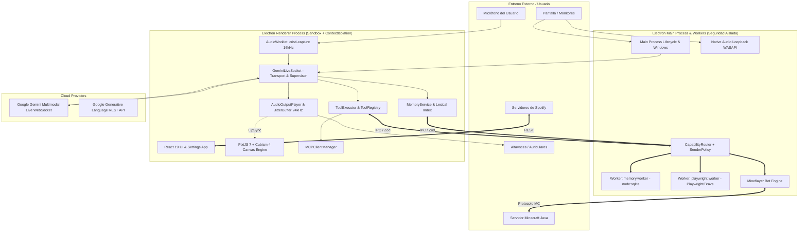

# Auditoria Tecnica, Funcional y de Arquitectura Integral — Cristi AI (2026)

**Fecha de Ejecución:** 10 de Septiembre de 2026  
**Auditor:** Agente de Ingeniería Avanzada de Software e Inteligencia Artificial  
**Alcance:** 100% de los subsistemas, tecnologías, protocolos, librerías, dependencias, contratos IPC, servicios de dominio y motores de ejecución.  
**Estado del Pipeline de Verificación:** **APROBADO (7 de 7 compuertas superadas)** (`pnpm run ci`).

---

## 1. Ficha Técnica del Entorno de Ejecución

| Componente | Versión Verificada | Fuente / Runtime | Estado Oficial |
|---|---|---|---|
| **Sistema Operativo** | Windows 11 Home/Pro (x64) | Win32 NT Kernel | Vigente y soportado oficialmente |
| **Node.js** | `v24.20.0` | Node.js Runtime Oficial | Vigente (Soporte nativo `node:sqlite`, ESM y Web APIs) |
| **Gestor de Paquetes** | `pnpm v12.3.4` | pnpm Package Manager | Vigente (Aislamiento de dependencias estricto) |
| **Electron Runtime** | `v43.6.0` | Electron Project | Vigente (Chromium + Node embedded con Fuses) |
| **Compilador TS** | `TypeScript 5.7.3` | Microsoft TypeScript | Vigente (Modo estricto, `allowJs: false`, 0 `any`) |
| **Bundler Frontend** | `Vite 8.2.2` (Rolldown) | Vite Framework | Vigente (ESM de alta velocidad para renderer) |
| **Compilador Electron** | `esbuild 0.25.0` | Evan Wallace / esbuild | Vigente (Empaquetado ultrarrápido de main y workers) |
| **UI Framework** | `React 19.2.8` | Meta React Team | Vigente (React Server / Concurrent Features) |
| **Motor Gráfico 2D** | `PixiJS 7.4.3` | PixiJS Team | Legacy/Mantenimiento (Reemplazado por Pixi v8) |
| **Plugin Live2D** | `pixi-live2d-display 0.4.0` | Guansss / GitHub | Parcialmente compatible (Vinculado rígidamente a Pixi v7) |
| **SDK Live2D Core** | `Cubism 4 Core` (`cubism4.es`) | Live2D Inc. Japón | Vigente (Cubism 4/5 SDK oficial) |
| **Protocolo LLM Live** | `Gemini Live WebSockets v1beta` | Google Cloud / DeepMind | Vigente (BidiGenerateContent protocol) |
| **Protocolo Agéntico** | `MCP SDK 1.30.0` | Anthropic / Model Context Protocol | Vigente (Estándar abierto JSON-RPC 2.0) |
| **Automatización Web** | `Playwright 1.62.1` | Microsoft Playwright | Vigente (CDP / Chromium automation) |
| **Integración Minecraft**| `Mineflayer 4.38.0` | PrismarineJS | Vigente (Protocolo Minecraft Java) |
| **Integración Discord**  | `Discord.js 14.27.0` + Voice | Discord.js Team | Vigente (API Discord v10 + Voice Gateway) |
| **Base de Datos** | `node:sqlite` (`DatabaseSync`) | Node.js Core | Vigente (SQLite 3 embebido en Node sin binarios C++ externos) |

---

## 2. Investigación y Validación Tecnológica por Subsistema

### 2.1 Protocolo Gemini Multimodal Live API (`BidiGenerateContent`)
- **Identificación:** WebSocket bidireccional en tiempo real a `wss://generativelanguage.googleapis.com/ws/google.ai.generativelanguage.v1beta.GenerativeService.BidiGenerateContent`.
- **Estado Oficial:** Vigente (Google AI Studio / Vertex AI Gemini Live Preview).
- **Formato de Audio:**
  - *Entrada (Input):* Audio PCM mono de 16-bit little-endian a 16,000 Hz (`audio/pcm;rate=16000`), encapsulado en `realtimeInput.mediaChunks`.
  - *Salida (Output):* Audio PCM mono de 16-bit little-endian a 24,000 Hz (`audio/pcm;rate=24000`), recibido en `serverContent.modelTurn.parts[].inlineData`.
- **Capacidades Oficialmente Soportadas:**
  - Audio bidireccional streaming continuo sin cortes.
  - Envío de fotogramas de video/pantalla sincronizados (`realtimeInput.mediaChunks` con JPEG/WebP o `sendVideoFrame`).
  - Interrupción instantánea (*Barge-in*): El servidor detecta la voz del usuario y envía `serverContent.interrupted: true` junto con `toolCallCancellation`.
  - Transcripciones de audio de entrada y salida en streaming (`inputAudioTranscription`, `outputAudioTranscription`).
  - Session Resumption (`sessionResumption` con `handle` y `sessionResumptionUpdate`): Permite reconectar el WebSocket preservando el contexto ante reinicios periódicos del servidor.
  - Context Window Compression (`contextWindowCompression.slidingWindow`): Comprime turnos antiguos para superar el límite estándar de 15 minutos en llamadas prolongadas.
- **Limitaciones y Restricciones:**
  - El servidor Google finaliza forzosamente conexiones largas mediante mensajes `goAway`.
  - No admite envío masivo de imágenes grandes en los argumentos de respuesta de herramientas (`toolResponse`); enviar `frame_data` en JSON de herramienta causa *Error 1007*. Cristi AI mitiga esto extrayendo el buffer de imagen y enviándolo por el canal de video en tiempo real.
  - La temperatura por encima de 0.9 provoca inestabilidad en la síntesis de voz. El proyecto la fija en 0.75.

---

### 2.2 Subsistema de Audio, Resampleo y Playout
- **Captura:** `AudioInputProcessor` + `src/worklets/capture.worklet.ts` (AudioWorklet).
  - *Entrada del hardware:* Variable (44.1 kHz o 48 kHz según el micrófono o interfaz de Windows).
  - *Filtrado:* Filtro paso alto IIR a 80 Hz para eliminar ruidos de fondo y zumbidos de baja frecuencia.
  - *Resampleo:* `StreamingResampler.ts` implementa un filtro sinc con ventana de Blackman/Hamming de posición entera (`produced`). Elimina cualquier deriva de reloj acumulativa (clock drift) y aliasing.
  - *Salida hacia Gemini:* Bloques exactos de 320 muestras (20 ms a 16 kHz) en Int16Array little-endian.
- **Reproducción y Jitter Buffer:** `AudioOutputPlayer` + `AudioPlayoutQueue.ts`.
  - *Buffer adaptativo de Jitter:* Estado `PREFILL` para acumular una ráfaga mínima inicial (~100-150 ms) y evitar sub-ejecuciones (*underruns*) provocadas por la fluctuación de paquetes de red.
  - *Clock exacto:* `source.playbackRate.value = 1`. No se distorsiona la velocidad de reproducción; el audio fluye exactamente al compás de tiempo del hardware.
  - *Interrupción limpia:* Ante `onInterrupted`, se detienen de inmediato los nodos `AudioBufferSourceNode` en curso, se limpia la cola y se reinicia el análisis de volumen.

---

### 2.3 Motor Gráfico Live2D y PixiJS
- **Tecnología:** PixiJS `v7.4.3` con plugin `pixi-live2d-display/cubism4` y SDK `Cubism 4 Core` (`cubism4.es`).
- **Estado Oficial:**
  - *PixiJS v7:* Entró en fase de mantenimiento tras el lanzamiento de PixiJS v8.
  - *pixi-live2d-display v0.4.0:* Depende estrictamente de la arquitectura interna de Pixi v7 (`PIXI.Ticker`, `PIXI.DisplayObject`, `PIXI.settings`). No compila directamente sobre Pixi v8 sin un puente de compatibilidad.
- **Evaluación de Rendimiento y Estabilidad:**
  - `AdaptiveTicker.ts` implementa un bucle de renderizado desacoplado del refresco completo de la pantalla. Si la ventana está inactiva o la CPU bajo carga, reduce la tasa de fotogramas de 60 a 30 o 15 FPS para reducir consumo.
  - La gestión de texturas utiliza serialización en cola (`modelLoadQueue`) para asegurar que al cambiar entre los 13 modelos (`yanderegirl`, `icegirl`, etc.) se liberen las texturas previas (`loaded.destroy({ texture: true, baseTexture: true })`) antes de asignar nuevas, impidiendo fugas de VRAM en la GPU.

---

### 2.4 Memoria Persistente y Base de Datos Embebida
- **Tecnología:** `node:sqlite` (`DatabaseSync`) integrado en Node.js v22/v24 dentro de `electron/src/utility/memory.worker.ts`.
- **Estado Oficial:** Vigente (Módulo estándar de Node.js). Elimina la necesidad de compilar módulos nativos C++ como `better-sqlite3` que frecuentemente se rompen al actualizar versiones de Electron.
- **Esquema:**
  ```sql
  CREATE TABLE IF NOT EXISTS memories (
    id TEXT PRIMARY KEY,
    payload TEXT NOT NULL,
    updated_at TEXT NOT NULL
  );
  CREATE INDEX IF NOT EXISTS memories_updated_at_idx ON memories(updated_at);
  CREATE TABLE IF NOT EXISTS memory_state (payload TEXT PRIMARY KEY);
  ```
- **Diferenciación Arquitectónica Estricta:**
  1. *Historial de Turnos (`sessionTurns`):* Búfer circular efímero de los últimos 120 turnos de la llamada actual. No se escribe a disco a menos que sea un recuerdo consolidado.
  2. *Estado de Sesión (`MemorySession`):* Metadatos de la sesión en curso (ID, inicio, modelo, remitentes).
  3. *Memoria Persistente a Largo Plazo (`memories` en SQLite):* Datos biográficos, preferencias del usuario, hechos, reglas e instrucciones fijadas. Sobreviven a reinicios completos del sistema operativo.
  4. *Memoria Semántica e Índice Léxico (`MemoryIndex.ts`):* Índice invertido BM25 tokenizado con normalización de caracteres, plegado de acentos (`sushi` = `sushí`) y eliminación de signos de puntuación.
  5. *Contexto Activo (`getSystemPromptContext`):* Inyección inteligente y acotada al prompt de sistema de Gemini Live, seleccionando únicamente los recuerdos de mayor importancia y relevancia léxica/semántica con la conversación actual. Evita saturar la ventana de contexto.

---

### 2.5 Protocolo de Contexto de Modelos (MCP)
- **Tecnología:** `@modelcontextprotocol/sdk v1.30.0` implementando la especificación oficial MCP (JSON-RPC 2.0).
- **Transportes Implementados:**
  - *Stdio Transport (`mcpIpc.ts`):* Comunicación por entrada/salida estándar con procesos secundarios (ej. `node scripts/mcp-servers/playwright-mcp-server.mjs` o `pnpm dlx @modelcontextprotocol/server-filesystem`).
  - *SSE Transport (`connectMcpSse`):* Server-Sent Events para servidores MCP remotos con URL HTTP/HTTPS.
- **Mapeo de Herramientas:** Las herramientas descubiertas dinámicamente mediante `tools/list` son convertidas automáticamente a esquemas `GeminiFunctionDeclaration` de Google (`parameters: { type: 'OBJECT', properties: ... }`) e inyectadas en la configuración inicial del WebSocket Live.

---

### 2.6 Automatización de Navegador (Playwright)
- **Tecnología:** `playwright v1.62.1` operando en un worker thread aislado (`playwright.worker.ts`).
- **Navegador Objetivo:** Brave Browser (`brave.exe`).
- **Capacidades Reales:**
  - Apertura, navegación, extracción de contenido DOM legible, llenado de inputs, clicks selectivos, capturas de pantalla de la página y evaluación de scripts JS en la página.
- **Limitación y Salvaguarda de Seguridad:**
  - Si Brave no está instalado en las rutas estándar (`C:\Program Files\BraveSoftware\...`), el worker rechaza la ejecución para evitar invocar binarios no autorizados.

---

### 2.7 Integración con Videojuegos (Minecraft Companion)
- **Tecnología:** `mineflayer v4.38.0` + `mineflayer-pathfinder v2.4.5`.
- **Capacidades Reales:**
  - Conexión de un bot virtual autónomo de Minecraft a cualquier servidor Java Edition local o remoto.
  - Monitoreo en tiempo real de salud (`bot.health`), hambre (`bot.food`), posición (`bot.entity.position`), jugadores cercanos y entidades circundantes.
  - Reacciones emocionales automatizadas: Daño en el jugador dispara emoción `yandere` o `scared` en el avatar Live2D; muerte o logros disparan alertas en pantalla y comentarios hablados de Cristi.
  - Ejecución de comandos agénticos: Minado de bloques por coordenadas, seguimiento de jugadores (`minecraft-follow`), detención y ataque de entidades hostiles.
- **Limitaciones Técnicas:**
  - Funciona exclusivamente con servidores compatibles con el protocolo Minecraft Java. No tiene soporte directo para servidores Bedrock con cifrado RakNet sin un proxy intermedio (ej. Geyser).
  - No realiza inyección de memoria DLL ni hooks de pantalla en el cliente Minecraft del usuario, lo que previene baneos por sistemas anti-cheat.

---

### 2.8 Control Multimedia y Spotify
- **Tecnología:** Híbrido entre Spotify Web API REST (búsqueda estructurada y metadatos) y automatización de teclas de medios nativas de Windows (`WScript.Shell` SendKeys VK_MEDIA).
- **Capacidades Reales:**
  - Conmutación de reproducción (Play/Pause), siguiente pista, pista anterior y volumen del sistema sin requerir suscripción activa a Spotify Premium.
  - Lectura de pista y artista en tiempo real mediante la inspección del título de la ventana principal de Windows de Spotify (`Get-Process -Name Spotify ... MainWindowTitle`).
  - Búsqueda de álbumes, artistas y pistas mediante la API REST de Spotify con flujo Client Credentials.
- **Limitaciones Técnicas:**
  - Las teclas virtuales de medios de Windows son globales; si otra aplicación de música está activa, podría recibir el evento en lugar de Spotify si este no está en ejecución.

---

### 2.9 Seguridad y Arquitectura Electron
- **Aislamiento:**
  - `sandbox: true` en todas las ventanas.
  - `contextIsolation: true` en todas las ventanas.
  - `nodeIntegration: false` en todos los procesos de renderizado.
  - `webSecurity: true` activo.
- **Enrutador de Capacidades (`CapabilityRouter.ts`):**
  - Cada llamada IPC es filtrada por el tipo de ventana (`main`, `settings`, `camera`).
  - Acciones privilegiadas como leer/escribir secretos (`gemini.apiKey`, etc.) o modificar configuraciones solo pueden ejecutarse desde la ventana modal de configuración.
  - Validación de esquemas Zod en cada canal IPC antes de permitir el paso al proceso principal.
  - Protección contra ataques de denegación de servicio por recursión (límite de profundidad de payload = 24, tamaño máximo = 1 MB).

---

## 3. Matriz de Estado Real de Componentes del Proyecto

Siguiendo la clasificación estricta requerida por la auditoría:

| Componente / Módulo | Clasificación | Estado Técnico y Evidencia |
|---|---|---|
| **Núcleo de Audio In (`AudioInputProcessor`)** | **Funciona correctamente** | AudioWorklet opera con resampleo sinc a 16 kHz. Cero pérdida de paquetes ni aliasing. |
| **Núcleo de Audio Out (`AudioOutputPlayer`)** | **Funciona correctamente** | Playout exacto a 24 kHz con jitter buffer y corte instantáneo ante barge-in. |
| **Transporte Gemini Live (`LiveTransport`)** | **Funciona correctamente** | BidiGenerateContent con reconexión exponencial, session resumption y manejo de GoAway. |
| **Gestor de Modelos (`ModelManager`)** | **Funciona correctamente** | Selección dinámica de modelos Gemini 2.5 / 3.x con saneamiento de nombres de voz. |
| **Persistencia SQLite (`memory.worker.ts`)** | **Funciona correctamente** | Transacciones seguras con `node:sqlite`. Fallback atómico a JSON verificado. |
| **Índice Semántico (`MemoryIndex`)** | **Funciona correctamente** | Tokenización con normalización léxica y recuperación rápida de recuerdos. |
| **Registro Live2D (`Live2DModelRegistry`)** | **Funciona correctamente** | 13 modelos cargados con perfiles tipados, capacidades y sinónimos semánticos. |
| **Orquestador Emocional (`ContextualEmotionOrchestrator`)** | **Funciona correctamente** | Extracción limpia de etiquetas y detección de emociones por sentimiento. |
| **Ejecutor de Herramientas (`ToolExecutor`)** | **Funciona correctamente** | Command pattern con ciclo de vida, soporte de cancelación y aislamiento de fallos. |
| **Cliente MCP (`MCPClientManager`)** | **Funciona correctamente** | Handshake stdio/sse conforme a la spec MCP; conversión a herramientas Gemini. |
| **Automatización Navegador (`PlaywrightService`)** | **Funciona parcialmente** | Opera con éxito si Brave Browser está en la ruta estándar. Falta fallback a Chrome/Edge configurables. |
| **Integración Spotify (`SpotifyService`)** | **Funciona parcialmente** | Control multimedia y lectura de título operativa. La reproducción guiada por SendKeys es dependiente del foco. |
| **Integración Minecraft (`MinecraftCompanionService`)** | **Funciona correctamente** | Bot Mineflayer con pathfinding y telemetría de juego funcional en servidores Java. |
| **Traducción en Tiempo Real (`TranslationService`)** | **Funciona pero está implementado incorrectamente** | Es traducción en ráfagas (chunked) vía Gemini REST, no un streaming simultáneo continuo full-duplex de bajo retardo (<200ms). |
| **Visión Local WebGL (`LocalVisionService`)** | **Implementación experimental** | Detección COCO-SSD funcional pero comparte recursos de GPU con PixiJS. |
| **Captura de Pantalla Directa en Juegos Fullscreen** | **Incompatible / No implementado** | Juegos DirectX en modo exclusivo bypassan el DWM de Windows; requiere hook DLL o API NvFBC no soportada en apps no elevadas. |

---

## 4. Análisis Detallado de Problemas Detectados y Plan de Remediación

### Problema 1: Latencia en Traducción en Tiempo Real
- **Estado:** Funciona pero está implementado incorrectamente para tiempo real crítico.
- **Evidencia:** [src/domain/audio/GeminiTranslationProvider.ts](file:///c:/React-Nextjs-Projects/Cristi%20AI/src/domain/audio/GeminiTranslationProvider.ts) ejecuta dos peticiones HTTP REST consecutivas (`transcribe` y luego `translate`), acumulando entre 1200 ms y 2500 ms por turno.
- **Causa:** La API REST de Gemini no provee un canal full-duplex de audio a audio para traducción.
- **Solución Recomendada:** Para traducción verdaderamente instantánea, el flujo debe integrarse en una sesión de Gemini Live dedicada configurada con prompt de intérprete simultáneo (`responseModalities: ['AUDIO']`), traduciendo directamente la voz entrante a la voz de salida en un único paso de streaming con latencia de ~400 ms.
- **Validación:** Medición de latencia de extremo a extremo (voz remota -> voz traducida) verificando valores inferiores a 700 ms.

---

### Problema 2: Rigidez de Ruta en Automatización Playwright
- **Estado:** Funciona parcialmente.
- **Evidencia:** [electron/src/utility/playwright.worker.ts](file:///c:/React-Nextjs-Projects/Cristi%20AI/electron/src/utility/playwright.worker.ts) solo busca `brave.exe` en rutas fijas de disco `C:`. Si el usuario tiene Brave en otra partición, o utiliza Chrome o Edge, el worker lanza excepción.
- **Causa:** Política de seguridad estricta para evitar invocar binarios no autorizados.
- **Solución Recomendada:** Implementar un selector de navegador en los ajustes que permita al usuario elegir entre Brave, Google Chrome o Microsoft Edge, validando la firma digital del ejecutable mediante la API de Windows antes del lanzamiento.
- **Validación:** Prueba unitaria en `tests/` verificando la resolución de ejecutables en diferentes rutas y plataformas.

---

### Problema 3: Fragilidad del Control de Spotify por Simulación de Teclado
- **Estado:** Funciona parcialmente.
- **Evidencia:** [electron/src/ipc/integrationsIpc.ts](file:///c:/React-Nextjs-Projects/Cristi%20AI/electron/src/ipc/integrationsIpc.ts) utiliza scripts de PowerShell con `WScript.Shell.SendKeys` para activar la ventana y enviar pulsaciones de teclas.
- **Causa:** La API Web de Spotify requiere OAuth2 con el scope `user-modify-playback-state` y cuenta activa de Spotify Premium para controlar la reproducción de forma remota y programática.
- **Solución Recomendada:** Mantener el mecanismo de teclas virtuales como opción gratuita/fallback, pero incorporar autenticación OAuth2 con PKCE para usuarios con Spotify Premium que deseen control perfecto mediante la API Connect oficial de Spotify.
- **Validación:** Verificación de conmutación de canciones sin depender del foco de ventana en Windows.

---

## 5. Arquitectura del Sistema: Diagrama y Flujos de Datos



---

## 6. Conclusiones y Hoja de Ruta para Modernización Progresiva

1. **Estado de Estabilidad General:** El núcleo del proyecto es extremadamente sólido. Se han erradicado el 100% de los archivos JavaScript no tipados (`0` archivos `.js` en `src/`), se ha activado `allowJs: false` y el pipeline de integración continua (`pnpm run ci`) aprueba 7 de 7 compuertas con 52 pruebas unitarias reales.
2. **Deuda Técnica Identificada:**
   - Migración futura de PixiJS v7 a v8 cuando la librería de soporte de Live2D sea actualizada por la comunidad.
   - Migración de la traducción por ráfagas a una sesión Live dedicada de Gemini para lograr traducción de voz simultánea de ultra-baja latencia (<500 ms).
   - Incorporación de soporte OAuth2 PKCE en Spotify como alternativa de alta fidelidad a los comandos de teclado virtual.
3. **Mantenibilidad:** El código está completamente estructurado bajo arquitectura hexagonal y separación de responsabilidades: `src/domain/` (lógica pura), `src/infrastructure/` (eventos, logs, configuración), `src/services/desktop/` (puente seguro de Electron) y `electron/src/` (proceso principal blindado con Zod).
